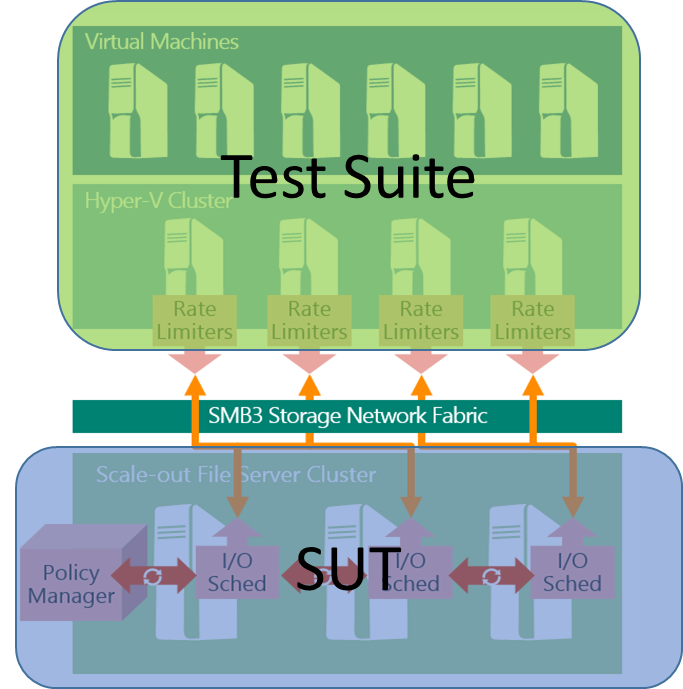
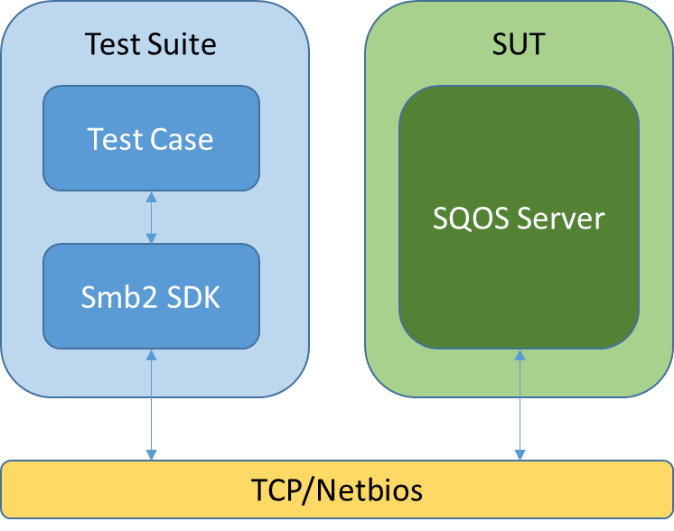

# MS-SQOS Protocol Server Test Design Specification 
# Windows is built to be the most interoperable platform 
#  MICROSOFT CORPORATION    August 17, 2015  Send suggestions and comments about this document to dochelp@microsoft.com.  Please include the name of the test suite with your feedback. 

##Contents
* [Contents](#_Toc427583960)
* [Protocol Summary](#_Toc427583961)
* [Test Scope](#_Toc427583962)
    * [System Under Test (SUT)](#_Toc427583963)
    * [Restrictions](#_Toc427583964)
    * [Dependencies](#_Toc427583965)
		* [Transport](#_Toc427583966)
		* [Prerequisites/Preconditions](#_Toc427583967)
* [Test Environment](#_Toc427583968)
    * [Non-Windows Implementation](#_Toc427583969)
    * [Windows Implementation](#_Toc427583970)
* [Test Suite Design](#_Toc427583971)
    * [Test Suite Architecture](#_Toc427583972)
    * [Test Case Design](#_Toc427583973)
		* [BVT Test Cases](#_Toc427583974)
		* [Negative Test Cases](#_Toc427583975)
* [References](#_Toc427583976)

## <a name="_Toc427583961"/>Protocol Summary
The Storage Quality of Service (QoS) Protocol is a block-based protocol that is used to manage the Quality of Service configuration of I/O flows targeting remote files accessed over SMB3.
The Storage QoS protocol is used to exchange configuration, metric and status data between the client and the server. The protocol allows a storage flow to be identified and a policy to be assigned to the operations belonging to the flow. For the purpose of illustrating the protocol behaviors, this specification assumes that on the server side there exists a Storage QoS implementation that is responsible for implementing policies by performing tasks such as collecting metrics, computing I/O rates for logical flows, determining status of logical flows, and manipulating I/O request queues to satisfy throughput requirements.

## <a name="_Toc427583962"/>Test Scope

### <a name="_Toc427583963"/>System under Test (SUT)
This test suite will test the server endpoint of MS-SQOS, and test suite acts as client role.
In Windows, the server role is acted by a scale-out file server which is made up of the nodes running Windows 10 or later. And the test suite acts a Hyper-V host. The below picture illustrates the roles including both test suite and SUT in Windows implementation. 

### <a name="_Toc427583964"/>Restrictions
None

### <a name="_Toc427583965"/>Dependencies

#### <a name="_Toc427583966"/>Transport
This protocol depends on Server Message Block (SMB) Protocol Version 3 for its transport.

#### <a name="_Toc427583967"/>Prerequisites/Preconditions
An SMB client has established a connection to an SMB server and has opened a remote .vhdx file. This has to be done before a client can issue any Storage QoS Protocol commands.

## <a name="_Toc427583968"/>Test Environment

### <a name="_Toc427583969"/>Non-Windows Implementation
For non-windows implementation, a vhdx file (sqos.vhdx) should be put under a share of the SUT.

### <a name="_Toc427583970"/>Windows Implementation
For windows implementation, it shares the same environment with FileSharing test suite family except adding one vhdx file in the scale-out file server and the OS version of nodes which make up of the scale-out file server should be Windows 10 or later.

Details of the environment is specified in section 1 of FileSharing_ServerTestDesignSpecification.docx

## <a name="_Toc427583971"/>Test Suite Design

### <a name="_Toc427583972"/>Test Suite Architecture

### <a name="_Toc427583973"/>Test Case Design
The Storage Quality of Service (QoS) Protocol allows a client application to perform the following high-level operations:

* Define a [logical flow](#z3) and specify a [QoS Policy](#z6) for the logical flow.

* Provide data used to compute I/O performance metrics for a logical flow.

* Retrieve status information for a logical flow.

* 3 BVT test cases and 9 negative cases are designed to cover the above scenarios.

#### <a name="_Toc427583974"/>BVT Test Cases
The first two BVT cases are to set or probe the SQOS policy for a logical flow. And then they check the response of querying status request to validate if the policy is set correctly.
The last BVT case is to test if the SUT can handle update counters request correctly. The case cannot verify if the metrics in SUT is updated, it just verifies the response to the update counters request.

| &#32;| &#32; |
| -------------| ------------- |
|  **Test ID**| BVT_Sqos_SetPolicy| 
|  **Description** | This test case is to test if server can handle an SQOS request to set policy to a logical flow.| 
|  **Prerequisites**| Client connects to the VHDX file (SMB2 Negotiate, SessionSetup, TreeConnect, and Create) and expects success.| 
|  **Test Execution Steps**| Client sends an SQOS request to associate the Open to a logical flow and expect success.| 
| | Client sends an SQOS request to set policy to a logical flow and expect success.| 
| | Client sends an SQOS request to query status to a logical flow and expect success.| 
|  **Cleanup**| Client disconnects to the VHDX file (SMB2 Close, TreeDisconnect, LogOff).| 

| &#32;| &#32; |
| -------------| ------------- |
|  **Test ID**| BVT_ProbePolicy| 
|  **Description** | This test case is designed to test if server can handle an SQOS request to probe policy to a logical flow.| 
|  **Prerequisites**| Client connects to the VHDX file (SMB2 Negotiate, SessionSetup, TreeConnect, and Create) and expects success.| 
|  **Test Execution Steps**| Client sends an SQOS request to probe policy to a logical flow and expect success.| 
| | Client sends an SQOS request to query status to a logical flow and expect success.| 
|  **Cleanup**| Client disconnects to the VHDX file (SMB2 Close, TreeDisconnect, LogOff).| 

| &#32;| &#32; |
| -------------| ------------- |
|  **Test ID**| BVT_UpdateCounters| 
|  **Description** | This test case is designed to test if server can handle an SQOS request to update counters for a logical flow.| 
|  **Prerequisites**| Client connects to the VHDX file (SMB2 Negotiate, SessionSetup, TreeConnect, and Create) and expects success.| 
|  **Test Execution Steps**| Client sends an SQOS request to associate the Open to a logical flow and expect success.| 
| | Client sends an SQOS request to set policy to a logical flow and expect success.| 
| | Client sends an SQOS request with flag STORAGE_QOS_CONTROL_FLAG_UPDATE_COUNTERS and the related non-zero parameters (IoCountIncrement, NormalizedIoCountIncrement, lowerLatencyIncrement and LatencyIncrement) to server and expects success.| 
|  **Cleanup**| Client disconnects to the VHDX file (SMB2 Close, TreeDisconnect, LogOff).| 

#### <a name="_Toc427583975"/> Negative Test Cases
The strategy of the negative cases is to check if SUT can handle SQOS request correctly when invalid value is set to some specific fields. 

| &#32;| &#32; |
| -------------| ------------- |
|  **Test ID**| Sqos_InvalidInitiatorNameOffset_Large| 
|  **Description** | This test case is to test if server can handle an SQOS request with an invalid large InitiatorNameOffset correctly.| 
|  **Prerequisites**| Client connects to the VHDX file (SMB2 Negotiate, SessionSetup, TreeConnect, and Create) and expects success.| 
|  **Test Execution Steps**| Client sends an SQOS request with flag STORAGE_QOS_CONTROL_FLAG_PROBE_POLICY and the field InitiatorNameOffset set to an invalid value (larger than expected) to server and expects STATUS_INVALID_PARAMETER.| 
|  **Cleanup**| Client disconnects to the VHDX file (SMB2 Close, TreeDisconnect, LogOff).| 

| &#32;| &#32; |
| -------------| ------------- |
|  **Test ID**| Sqos_InvalidInitiatorNameOffset_Small| 
|  **Description** | This test case is to test if server can handle an SQOS request with an invalid small InitiatorNameOffset correctly| 
|  **Prerequisites**| Client connects to the VHDX file (SMB2 Negotiate, SessionSetup, TreeConnect, and Create) and expects success.| 
|  **Test Execution Steps**| Client sends an SQOS request with flag STORAGE_QOS_CONTROL_FLAG_PROBE_POLICY and the field InitiatorNameOffset set to an invalid value (smaller than expected) to server and expects STATUS_INVALID_PARAMETER.| 
|  **Cleanup**| Client disconnects to the VHDX file (SMB2 Close, TreeDisconnect, LogOff).| 

| &#32;| &#32; |
| -------------| ------------- |
|  **Test ID**| Sqos_InvalidInitiatorNodeNameOffset_Large| 
|  **Description** | This test case is to test if server can handle an SQOS request with an invalid large InitiatorNodeNameOffset correctly| 
|  **Prerequisites**| Client connects to the VHDX file (SMB2 Negotiate, SessionSetup, TreeConnect, and Create) and expects success.| 
|  **Test Execution Steps**| Client sends an SQOS request with flag STORAGE_QOS_CONTROL_FLAG_PROBE_POLICY and the field InitiatorNodeNameOffset set to an invalid value (larger than expected) to server and expects STATUS_INVALID_PARAMETER.| 
|  **Cleanup**| Client disconnects to the VHDX file (SMB2 Close, TreeDisconnect, LogOff).| 

| &#32;| &#32; |
| -------------| ------------- |
|  **Test ID**| Sqos_InvalidInitiatorNodeNameOffset_Small| 
|  **Description** | This test case is to test if server can handle an SQOS request with an invalid small InitiatorNodeNameOffset correctly| 
|  **Prerequisites**| Client connects to the VHDX file (SMB2 Negotiate, SessionSetup, TreeConnect, and Create) and expects success.| 
|  **Test Execution Steps**| Client sends an SQOS request with flag STORAGE_QOS_CONTROL_FLAG_PROBE_POLICY and the field InitiatorNodeNameOffset set to an invalid value (smaller than expected) to server and expects STATUS_INVALID_PARAMETER.| 
|  **Cleanup**| Client disconnects to the VHDX file (SMB2 Close, TreeDisconnect, LogOff).| 

| &#32;| &#32; |
| -------------| ------------- |
|  **Test ID**| Sqos_InvalidOption| 
|  **Description** | This test case is to test if server can handle an SQOS request with an invalid Option correctly| 
|  **Prerequisites**| Client connects to the VHDX file (SMB2 Negotiate, SessionSetup, TreeConnect, and Create) and expects success.| 
|  **Test Execution Steps**| Client sends an SQOS request with the field Option set to an invalid value (zero) to server and expects STATUS_INVALID_PARAMETER.| 
|  **Cleanup**| Client disconnects to the VHDX file (SMB2 Close, TreeDisconnect, LogOff).| 

| &#32;| &#32; |
| -------------| ------------- |
|  **Test ID**| Sqos_InvalidPolicyId| 
|  **Description** | This test case is to test if server can handle an SQOS request with an invalid policy id correctly| 
|  **Prerequisites**| Client connects to the VHDX file (SMB2 Negotiate, SessionSetup, TreeConnect, and Create) and expects success.| 
|  **Test Execution Steps**| Client sends an SQOS request with flag STORAGE_QOS_CONTROL_FLAG_PROBE_POLICY and the field PolicyID set to an invalid value (a non-existing PolicyID) to server and expects STATUS_INVALID_PARAMETER.| 
|  **Cleanup**| Client disconnects to the VHDX file (SMB2 Close, TreeDisconnect, LogOff).| 

| &#32;| &#32; |
| -------------| ------------- |
|  **Test ID**| Sqos_InvalidProtocolVersion| 
|  **Description** | This test case is to test if server can handle an SQOS request with an invalid protocol version correctly| 
|  **Prerequisites**| Client connects to the VHDX file (SMB2 Negotiate, SessionSetup, TreeConnect, and Create) and expects success.| 
|  **Test Execution Steps**| Client sends an SQOS request with flag STORAGE_QOS_CONTROL_FLAG_SET_LOGICAL_FLOW_ID and the field ProtocolVersion (0xFFFF) set to an invalid value to server and expects STATUS_REVISION_MISMATCH.| 
|  **Cleanup**| Client disconnects to the VHDX file (SMB2 Close, TreeDisconnect, LogOff).| 

| &#32;| &#32; |
| -------------| ------------- |
|  **Test ID**| Sqos_ReservationGreaterThanLimit| 
|  **Description** | This test case is to test if server can handle an SQOS request correctly when Request.Reservation is greater than Request.Limit| 
|  **Prerequisites**| Client connects to the VHDX file (SMB2 Negotiate, SessionSetup, TreeConnect, and Create) and expects success.| 
|  **Test Execution Steps**| Client sends an SQOS request with flag STORAGE_QOS_CONTROL_FLAG_PROBE_POLICY and Request.Reservation is greater than Request.Limit and expects STATUS_INVALID_PARAMETER.| 
|  **Cleanup**| Client disconnects to the VHDX file (SMB2 Close, TreeDisconnect, LogOff).| 

| &#32;| &#32; |
| -------------| ------------- |
|  **Test ID**| Sqos_SetPolicyToNonAssociatedLogicalFlow| 
|  **Description** | This test case is to test if server can handle an SQOS request correctly when Request.Reservation is greater than Request.Limit| 
|  **Prerequisites**| Client connects to the VHDX file (SMB2 Negotiate, SessionSetup, TreeConnect, and Create) and expects success.| 
|  **Test Execution Steps**| Client sends an SQOS request with flag STORAGE_QOS_CONTROL_FLAG_SET_POLICY and the Open is not associated to a logical flow and expects STATUS_NOT_FOUND.| 
|  **Cleanup**| Client disconnects to the VHDX file (SMB2 Close, TreeDisconnect, LogOff).| 

## <a name="_Toc427583976"/>References
Jose Barreto’s blog: [Storage Quality of Service Guide Released for Windows Server Technical Preview](http://blogs.technet.com/b/josebda/archive/2014/10/24/storage-quality-of-service-guide-released-for-windows-server-technical-preview.aspx)
Presentation in 2014 Snia event: [Storage Quality of Service for Enterprise Workloads](http://www.snia.org/sites/default/files/TomTalpey_Storage_Quality_Service.pdf)

